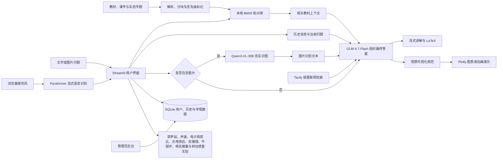

# 大学物理智能助教

面向大学物理课程的本地 RAG 智能助教。项目以祝之光《物理学》第 5 版及配套习题解答为主要依据，并使用课程资料和实验专题知识作为补充，支持教材检索、概念讲解、公式推导、图片识题、流式语音输入、历史对话和交互式物理实验。

> 回答以本地知识库为核心；遇到明确联网请求或时效性问题时，应用按需调用 Tavily 检索网络资料，再由本地模型统一组织答案。教材课程口径与网络资料不一致时以教材为准。

> 项目已在学校服务器部署运行。校内访问地址：[https://192.168.222.147:1234/agent/](https://192.168.222.147:1234/agent/)

## 功能

- 本地 RAG：检索教材、习题解答、课件及实验专题知识。
- 网络内容补充：应用按需调用 Tavily 检索知识库未覆盖的背景、最新进展与拓展内容，并交给本地模型与教材结论整合。
- 多模态问答：可直接粘贴或上传题目图片。
- 实时语音输入：浏览器录音经 Paraformer-zh-streaming 在本机逐段转写，最终文字填入提问框供确认。
- 流式讲解：支持连续对话、LaTeX 公式和回答位置跟随。
- 安全可视化：模型生成结构化绘图规范，由本地校验后使用 Plotly 渲染。
- 双学习模式：在侧栏切换“智能助教”和“可视化实验”。
- 交互实验：Windows 主项目内置李萨如图形、声速测量、电子荷质比、光电效应、双棱镜干涉测波长、牛顿环、杨氏模量和转动惯量测定八套 Julia/WGLMakie 实验。
- 用户系统：支持注册登录、匿名进入、历史恢复、按问答轮次删除及 Markdown 导出；未回答问题也可单独删除。
- 管理后台：支持身份名册、学习活动、反馈和运行错误统计。
- 主题与快捷操作：支持亮色、暗色、跟随系统以及随机快速提问。
- 无模型降级：模型不可用时仍可返回本地检索结果。

## 知识库

### 检索性能

本地 BM25 检索使用倒排索引和预缓存词频。查询时只计算包含查询词的候选文本块，并使用 Top-K 堆排序，避免每次扫描全部知识块。首次加载会读取 JSONL 并建立索引，之后由 Streamlit 资源缓存复用；知识库更新后重启应用即可刷新索引。

当前构建清单来自 `agnet/knowledge_base/manifest.json`：

| 内容 | 数量 |
| --- | ---: |
| 扫描文件 | 668 |
| 教学素材文本块 | 35,973 |
| 电子荷质比专题文本块 | 1,336 |
| 李萨如专题文本块 | 10,122 |
| 声速专题文本块 | 4,047 |
| 光电效应专题文本块 | 301 |
| 双棱镜干涉专题文本块 | 517 |
| 牛顿环专题文本块 | 113 |
| 杨氏模量专题文本块 | 354 |
| 转动惯量专题文本块 | 285 |
| 合计文本块 | 53,048 |

其中包括 114 个 PDF、145 个 PPT/PPTX/PPTM/POT 和 389 个 DOC/DOCX 文件。检索使用本地 BM25，并对中文文本加入相邻双字切分。教材正文优先，习题解答次之，其他教学资料和实验知识作为补充。

竞赛项目只提供实验专题知识，不会加载其中的智能体、提示词或用户系统。

## 工作流程



一次普通问答会经历以下过程：

1. 从本地知识库检索与问题最相关的教材和课程内容；
2. 若问题具有时效性或明确要求联网，由应用调用 Tavily，并把清洗后的结果作为外部参考；上传图片先由视觉模型识别，只把识别文本交给回答模型；
3. 将知识库内容、按需联网结果、最近两轮历史和当前问题交给 GLM，以教材内容为主线组织答案；
4. 在页面中流式显示整合后的答案，并持续渲染 Markdown 与 LaTeX；
5. 若答案包含受支持的可视化规范，则在代码之后直接生成运行演示；
6. 注册用户的问答写入历史，反馈与错误写入学情数据库。

## 项目结构

```text
仁爱大学物理智能助教/
├─ README.md                 # 本说明
├─ check_portable_paths.py   # 迁移路径检查
├─ 教学素材/                # Windows 主项目的原始教学资源
├─ agnet/                    # Windows 主项目（保留原目录名）
│  ├─ app.py                # Streamlit 主界面
│  ├─ llm.py                # 模型调用与流式输出
│  ├─ rag.py                # 本地 BM25 检索
│  ├─ build_kb.py           # 知识库构建
│  ├─ visualization.py      # 可视化规范校验和绘图
│  ├─ experiment_hub.py     # 实验启动与嵌入
│  ├─ gateway.py            # 8501 同源入口及内嵌实验代理
│  ├─ voice_input.py        # 浏览器录音与流式转写组件
│  ├─ asr_service.py        # Paraformer 内部 WebSocket 服务
│  ├─ download_asr_model.py # 固定版本 INT8 模型下载与校验
│  ├─ experiments/          # 八套 Julia/WGLMakie 实验
│  ├─ storage.py            # 用户、会话和 Markdown 导出
│  ├─ analytics_db.py       # 学情与反馈数据
│  ├─ admin_api.py          # 管理员后台
│  ├─ data/                 # SQLite 数据库及运行数据
│  └─ knowledge_base/       # RAG 文本块、专题索引和清单
└─ agent_of_college_physics/ # 可独立复制的 Rocky Linux 10 完整版本
   ├─ install.sh            # 普通用户一键安装
   ├─ manage.sh             # 用户级服务管理
   ├─ agnet/                # Rocky 应用、数据和知识库副本
   └─ 教学素材/             # Rocky 原始教学资源副本
```

Windows 版和 Rocky 版是两套独立部署。修改其中一套的运行数据不会自动同步到另一套。

## Windows 版

### 环境要求

- Windows 10/11；
- Python 3.13，由启动脚本通过 `uv` 创建环境；
- [uv](https://docs.astral.sh/uv/)；
- Julia 1.10，仅可视化实验需要；
- 支持 WebGL2 的现代浏览器；
- 使用麦克风时需要浏览器认可的安全来源（`localhost` 或可信 HTTPS）；
- OpenAI Chat Completions 兼容的文本或视觉模型服务。

Poppler 用于提取 PDF 文本；WPS Office 可帮助解析旧式 `.doc`、`.ppt` 和 `.pot` 文件。现成知识库无需重新安装这些解析工具。

### 启动

```powershell
cd .\agnet
.\start_all.ps1
```

浏览器访问：

```text
http://localhost:8501
```

`start_all.ps1` 同时启动主应用、管理员服务和语音识别服务。只启动主应用时可运行 `start.ps1` 或双击 `start.bat`。首次启动会下载并校验约 226.5 MiB 的 Paraformer 流式 INT8 模型；模型保存在 `agnet/runtime/asr/`，不会重复下载。

Windows 版端口：

| 服务 | 监听地址 |
| --- | --- |
| 对外统一入口 | `0.0.0.0:8501` |
| Streamlit 内部服务 | 仅监听本机 |
| 管理员内部服务 | 仅监听本机 |
| Paraformer 语音服务 | `127.0.0.1:8604`，由 `8501/asr/...` 代理 |
| 八套可视化实验 | 仅监听本机，通过 `8501/experiments/...` 内嵌 |

### 模型及管理员配置

```powershell
Copy-Item .\.streamlit\secrets.toml.example .\.streamlit\secrets.toml
```

编辑 `agnet/.streamlit/secrets.toml`：

```toml
physics_api_key = ""
physics_base_url = "https://192.168.222.147:1234/v1"
physics_model = "glm47-local-prod"
physics_vision_model = "qwen-vl30-local-prod"
physics_vision_max_output_tokens = "1024"
physics_chat_no_think_suffix = "/nothink"
physics_vision_no_think_suffix = "/no_think"
physics_ca_bundle = ".streamlit/physics-assistant-ca.crt"
physics_context_window = "8192"
physics_history_max_messages = "4"
physics_max_output_tokens = "1024"
kb_context_max_chars = "2500"

admin_username = "admin"
admin_display_name = "课程管理员"
admin_password = "至少 12 位的独立强密码"
admin_token = "足够长的随机令牌"
admin_login_url = "/admin-login"
```

当前采用本地双模型路由：普通对话和最终答案由学校 Rocky 服务器 `tjracphy` 本机的 GLM-4.7-Flash 生成，生产 API 标识为 `glm47-local-prod`；上传图片时先由本机 Qwen3-VL-30B-A3B-Instruct 提取题干、公式、图表和实验信息，生产 API 标识为 `qwen-vl30-local-prod`，随后只把识别文本交给 GLM 结合知识库组织答案。两个模型均以 8K 上下文、4 个并行槽无 TTL 常驻。Rocky 应用通过 `127.0.0.1:1235` 直连本机 LM Studio，不经过 LM Link；Windows 开发版通过服务器公开 API 入口调用同一组本地模型。

Windows 与 Rocky 版本均已配置并启用 Tavily Search API 联网补充。普通教材概念、公式推导和计算题不会联网；问题明确要求联网，或包含“最新、近期、目前、进展、现行标准”等时效性表达时，应用才发送当前问题文本进行搜索。搜索结果经过清洗和长度限制后作为不可信外部参考交给 GLM，并在答案末尾附真实来源链接；搜索超时、额度不足或接口故障时自动退回本地知识库。结果在进程内缓存 30 分钟，用户身份、历史记录和图片不会发送给搜索服务。

不要把 `secrets.toml`、API Key、密码或内网令牌提交到 Git。

也可以使用环境变量覆盖配置：

| 环境变量 | 用途 |
| --- | --- |
| `PHYSICS_BASE_URL` | OpenAI-compatible API 根地址，通常以 `/v1` 结尾 |
| `PHYSICS_MODEL` | 对话与最终答案模型 ID，当前为 `glm47-local-prod` |
| `PHYSICS_VISION_MODEL` | 图片识别模型 ID，当前为 `qwen-vl30-local-prod` |
| `PHYSICS_VISION_MAX_OUTPUT_TOKENS` | 图片识别阶段最大输出 token，默认 1024 |
| `PHYSICS_CHAT_NO_THINK_SUFFIX` | GLM 关闭思考的提示后缀，当前为 `/nothink` |
| `PHYSICS_VISION_NO_THINK_SUFFIX` | Qwen-VL 关闭思考的提示后缀，当前为 `/no_think` |
| `PHYSICS_CA_BUNDLE` | 可选的 HTTPS 模型服务 CA 公钥证书路径 |
| `PHYSICS_WEB_SEARCH_PROVIDER` | 可选联网搜索提供方；设为 `tavily` 后与密钥共同启用 |
| `TAVILY_API_KEY` | Tavily 服务密钥；Windows 保存在 `.streamlit/secrets.toml`，Rocky 保存在 `config/physics-assistant.env` |
| `PHYSICS_WEB_SEARCH_MAX_RESULTS` | 单次最多使用的搜索结果数，默认 5 |
| `PHYSICS_WEB_SEARCH_TIMEOUT_SECONDS` | 联网搜索读取超时，默认 8 秒 |
| `PHYSICS_WEB_SEARCH_CACHE_MINUTES` | 相同问题搜索结果缓存时间，默认 30 分钟 |
| `PHYSICS_USER_SESSION_SECONDS` | 注册用户刷新后保持登录的时长，默认 604800 秒（7 天），允许 1 小时至 30 天 |
| `PHYSICS_API_KEY` | 模型服务密钥；无鉴权的本地服务可留空 |
| `DASHSCOPE_API_KEY` | 兼容的 Qwen/DashScope 回退密钥 |
| `PHYSICS_CONTEXT_WINDOW` | 模型上下文窗口预算 |
| `PHYSICS_HISTORY_MAX_MESSAGES` | 单次请求最多携带的历史消息数 |
| `PHYSICS_MAX_OUTPUT_TOKENS` | 单次回答最大输出 token 数 |
| `PHYSICS_JULIA_EXE` | Julia 可执行文件路径 |
| `PHYSICS_CJK_FONT` | Rocky 上可选的中文字体文件 |
| `PHYSICS_ASR_THREADS` | Paraformer 单批 CPU 推理线程数，默认 4 |
| `PHYSICS_ASR_MAX_CONNECTIONS` | 同时语音连接上限，默认 4 |
| `PHYSICS_ASR_MAX_AUDIO_SECONDS` | 单次录音时长上限，默认 180 秒 |

联网检索属于固定回答策略，不设置用户开关。模型名称只保存在配置和运行日志中，普通用户页面不会展示底层模型 ID。

### Windows 局域网访问

以管理员身份打开 PowerShell，在项目根目录运行：

```powershell
.\agnet\enable_lan.ps1
```

脚本只为专用网络开放统一入口 `8501`。管理员页面和八套可视化实验均从主站内嵌访问，不再单独开放端口。其他设备访问 `http://Windows主机IP:8501`。

> Edge/Chrome 只允许安全来源调用麦克风。`http://localhost:8501` 可录音，但其他电脑通过普通 HTTP IP 地址访问时，语音按钮会提示需要 HTTPS；正式局域网语音输入应在统一入口配置客户端信任的 HTTPS 证书，WebSocket 会自动使用 WSS。

## Rocky Linux 10 独立版

Rocky 版已包含应用、知识库、已整理教学素材与八套实验；用户、历史和其他运行数据仅可按受控流程另行迁移，不包含在公开源码中。它只安装在复制后的普通用户目录中：

- 不允许使用 `sudo` 或 root 执行；
- 不写入 `/opt`、`/etc`、`/var` 或 `/usr/local`；
- 不修改 systemd、Nginx、SELinux 或 firewalld；
- Python、Julia、配置、日志和 PID 均保存在 `agent_of_college_physics` 目录内。

### 复制与安装

在 Windows 项目根目录复制：

```powershell
scp -r ".\agent_of_college_physics" 用户名@Rocky服务器IP:~/
```

登录服务器后，以普通用户执行：

```bash
cd ~/agent_of_college_physics
bash install.sh
```

`8501` 是 Rocky 服务器内部供反向代理使用的统一上游，不作为当前校园网入口公开。当前生产环境只通过以下 HTTPS 地址访问：

[https://192.168.222.147:1234/agent/](https://192.168.222.147:1234/agent/)

使用该子路径入口时，需要在
`config/physics-assistant.env` 中设置：

```ini
PHYSICS_PUBLIC_BASE_URL=https://192.168.222.147:1234/agent
```

该值用于让八套可视化实验、Paraformer 语音服务、持久登录和管理员页面正确生成带 `/agent/` 前缀的 HTTPS/WSS 地址，并校验浏览器看到的公开端口。项目自带的 `8443` HTTPS 网关只作为独立部署时的备用方案，当前未对校园网络开放。详细要求见 [Rocky 部署说明](agent_of_college_physics/README.md)。

### 服务管理

```bash
cd ~/agent_of_college_physics
bash manage.sh start
bash manage.sh stop
bash manage.sh restart
bash manage.sh status
bash manage.sh check
bash manage.sh logs
```

Rocky 版不会注册系统级开机服务，服务器重启后需再次执行 `bash manage.sh start`。

Rocky 版使用目录内的 Python 网关提供内部 HTTP 上游，当前由学校 `1234` 反向代理统一提供生产 HTTPS/WSS；项目自带 HTTPS 网关仅作备用：

| 服务 | 监听地址 |
| --- | --- |
| 当前校内公开入口 | `https://192.168.222.147:1234/agent/` |
| HTTP 内部上游 | `0.0.0.0:8501`，只供服务器内部和现有反向代理使用，不对校园网络开放 |
| 备用 HTTPS/WSS 入口 | `0.0.0.0:8443`，仅在独立部署执行 `setup_https.sh` 后启用，当前校园网络未开放 |
| Streamlit 内部服务 | `127.0.0.1:8502` |
| 管理员内部服务 | `127.0.0.1:8603` |
| Paraformer 语音服务 | `127.0.0.1:8604`，仅由统一入口代理 |
| 八套可视化实验 | 分别使用 `9384`–`9391`，仅监听 `127.0.0.1`，由统一入口代理 |

安装脚本不会修改防火墙。当前校园网络只需访问已有的 TCP `1234` HTTPS 反向代理；不要向校园网络开放 `8501`、`8443`、Streamlit、管理员、ASR 或实验内部端口。

Rocky 模型配置位于：

```text
~/agent_of_college_physics/config/physics-assistant.env
```

修改后执行 `bash manage.sh restart`。

Rocky 安装脚本会在用户目录中准备 Python 3.13、项目虚拟环境、Julia 1.10.10 和 Julia depot。安装阶段需要访问 Python 包源与 Julia 官方下载站；回答阶段由应用按规则调用 Tavily API，并将清洗后的结果交给本地 GLM 组织答案，模型服务自身不负责网页检索，应用也不启动独立网页爬虫。

安装器还会从固定版本的 Sherpa-ONNX 模型仓库下载三个经过 SHA-256 校验的 Paraformer INT8 文件，总计约 226.5 MiB；不会保留 1 GiB 的完整模型归档或 FP32 文件。

## 实时语音输入

“智能助教”模式把麦克风按钮放在提问框内部、发送按钮左侧。点按开始录音，再次点按停止；浏览器把单声道音频重采样为 16 kHz Float32 PCM，并通过同源 WebSocket 持续发送。中间识别结果显示在输入框上方的小浮层中，停止后才把最终文字填入聊天框，不会自动发送，用户仍可检查或修改文字。

语音后端采用 `sherpa-onnx 1.13.4` 和中英双语 `Paraformer-zh-streaming` INT8 模型，以独立的轻量运行时提供服务，不依赖 PyTorch、FFmpeg 或系统麦克风设备。模型固定到公开仓库的具体 revision 并校验每个文件的大小与 SHA-256，许可证为 Apache-2.0。该模型不提供词级时间戳；Sherpa 的在线 Paraformer 接口也没有真正的热词偏置，本项目仅对少量常见物理术语做确定性纠错。

浏览器麦克风权限有一项必须满足的前提：非 `localhost` 页面通常需要客户端信任的 HTTPS。当前生产入口已统一为 `https://192.168.222.147:1234/agent/`，浏览器通过同源 WSS 使用语音服务，不需要开放 `8443` 或 `8604`。`setup_https.sh` 只用于没有外层 HTTPS 反向代理的独立备用部署；客户端只可导入 CA 公钥证书，绝不能复制 CA 私钥或服务器私钥。

## 登录、历史与管理员后台

首次打开主页会先显示登录入口：

- **注册用户**：登录后持续保存对话历史，可按轮次同时删除问题和回答，也可删除未回答的问题、恢复会话并导出 Markdown；浏览器使用签名的 HttpOnly Cookie 保持登录，刷新页面不会要求重新输入密码，默认有效期为 7 天；
- **匿名用户**：无需注册即可进入，消息只在当前浏览器会话中保留，也可按同样规则删除问答或手动导出 Markdown；
- **管理员用户**：在同一登录页面验证账号后跳转管理员页面。

注册用户的保持登录令牌不包含密码，由服务器签名，并在 HTTPS 下自动设置 `Secure` 属性；退出登录会同步清除浏览器 Cookie。Rocky 可通过 `PHYSICS_USER_SESSION_SECONDS` 调整有效期，允许范围为 1 小时至 30 天。

注册账号、消息、反馈、身份名册和学情记录统一保存在：

```text
agnet/data/assistant.db
```

管理员后台包含：

- 注册用户、匿名请求和活跃情况总览；
- 章节和主题分布；
- 回答评价及用户意见；
- 模型、网络、图片识别和可视化运行错误；
- Excel 身份名册导入及账号关联。
- 身份名册可在管理页面逐条新增、修改和删除；已绑定账号的记录会受到保护。

Windows 版管理员 API 默认仅监听 `127.0.0.1:8603`。Rocky 版由内部 `8501` 网关转发管理员路由，因此学生页面和管理员页面在生产环境共用 `https://192.168.222.147:1234/agent/` 同源入口，`8603` 不对局域网开放。

每次新问答的分阶段响应耗时仅在管理员页面显示，学生界面不展示开发联调数据；管理员可查看最近 30 次问答的知识检索、上下文拼装、历史加载、首段答案、模型生成和端到端耗时。

历史消息会受到上下文预算限制：数据库仍长期保留完整记录，但默认只向模型发送最近两轮完整问答（4 条消息），并将知识库上下文控制在 2500 字符以内。普通回答默认最多生成 1024 token，并提示模型优先在 600～800 个中文字符内完整作答。这能保留追问所需语境，同时显著缩短本地模型的提示词处理和生成时间。

## 重新构建知识库

Windows：

```powershell
cd .\agnet
.\.venv\Scripts\python.exe .\build_kb.py
```

Rocky：

```bash
cd ~/agent_of_college_physics
./agnet/.venv/bin/python ./agnet/build_kb.py
```

构建结果位于 `agnet/knowledge_base/`：

- `chunks.jsonl`：可检索文本块；
- `manifest.json`：文件数、文本块数、失败记录和资料策略；
- `imports/electron_em.jsonl`：电子荷质比、圆轨道法、磁聚焦、亥姆霍兹线圈与汤姆孙法专题知识；
- `imports/photoelectric.jsonl`：光电效应、伏安特性、红限、普朗克常量拟合和遏止电压判读专题知识；
- `imports/lissajous.jsonl`：李萨如实验专题知识；
- `imports/sound_speed.jsonl`：声速测量专题知识；
- `imports/biprism.jsonl`：双棱镜分波阵面、钠黄光条纹、二次成像测虚光源间距及波长不确定度专题知识。
- `imports/newton_rings.jsonl`：牛顿环等厚干涉、半波损失、读数显微镜、逐差法、曲率半径线性拟合与不确定度专题知识。
- `imports/young_modulus.jsonl`：金属丝静态拉伸、光杠杆放大、加载与卸载、力—伸长拟合、杨氏模量与不确定度专题知识。
- `imports/rotational_inertia.jsonl`：扭摆、三线摆、平行轴定理、复摆周期拟合、转动惯量与不确定度专题知识。

转动惯量专题的可视化方案、约 10 篇核心参考题录和 8 份本地核验 PDF 位于 `教学素材/物理实验/转动惯量测定/`。单独更新该专题时先运行 `agnet/build_rotational_inertia_import.py`，再用下述合并命令刷新主知识库。

若只更新了专题索引，Windows 可运行：

```powershell
.\.venv\Scripts\python.exe .\build_kb.py --merge-imports-only
```

扫描版 PDF 没有文字层时应先 OCR。Rocky 重新解析旧 Office 文件时建议由服务器管理员提供 LibreOffice headless；现成知识库的使用不受影响。

## 可视化实验

首页侧栏切换到“可视化实验”后可选择：

- 李萨如图形：相位差、振幅比、有理频率比和频率失谐；
- 声速测量：回声法、双麦克风时差法、示波器相位差法和驻波法。
- 电子荷质比：电子束圆轨道、亥姆霍兹磁场标定、纵向磁聚焦和汤姆孙交叉电磁场。
- 光电效应：伏安特性与光强、普朗克常量拟合、红限与量子规律、遏止电压判读与系统误差。
- 双棱镜干涉测钠黄光波长：分波阵面与虚光源、钠黄光干涉条纹、凸透镜二次成像测间距、波长拟合与不确定度。
- 牛顿环等厚干涉：半波损失与环纹形成、读数显微镜单向扫描、15 级逐差法、直径平方线性拟合与不确定度。
- 杨氏模量测定：光杠杆微小伸长放大、加载与卸载读数、力—伸长线性拟合、杨氏模量与不确定度。
- 转动惯量测定：扭摆法、三线摆法、平行轴定理验证，以及摆动周期拟合与不确定度。

八类实验均拆分为四个独立页面，只构建和加载当前选中的页面：李萨如为 `/phase`、`/amplitude`、`/ratio`、`/detune`；声速为 `/echo`、`/dual`、`/phase`、`/standing`；电子荷质比为 `/circular`、`/helmholtz`、`/focus`、`/thomson`；光电效应为 `/iv`、`/planck`、`/threshold`、`/uncertainty`；双棱镜为 `/geometry`、`/fringes`、`/separation`、`/wavelength`；牛顿环为 `/formation`、`/measurement`、`/difference`、`/fit`；杨氏模量为 `/principle`、`/loading`、`/fit`、`/uncertainty`；转动惯量为 `/torsion`、`/trifilar`、`/parallel-axis`、`/pendulum-fit`。双棱镜和牛顿环均以 `589.3 nm` 钠黄光为教学参考值。

实验按需启动，主要图形在客户端浏览器通过 WebGL2 渲染。Windows 首次使用前可手动初始化：

```powershell
cd .\agnet
julia --project=experiments/lissajous -e "using Pkg; Pkg.instantiate(); Pkg.precompile()"
julia --project=experiments/sound_speed -e "using Pkg; Pkg.instantiate(); Pkg.precompile()"
julia --project=experiments/electron_em -e "using Pkg; Pkg.instantiate(); Pkg.precompile()"
julia --project=experiments/photoelectric -e "using Pkg; Pkg.instantiate(); Pkg.precompile()"
julia --project=experiments/biprism -e "using Pkg; Pkg.instantiate(); Pkg.precompile()"
julia --project=experiments/newton_rings -e "using Pkg; Pkg.instantiate(); Pkg.precompile()"
julia --project=experiments/young_modulus -e "using Pkg; Pkg.instantiate(); Pkg.precompile()"
julia --project=experiments/rotational_inertia -e "using Pkg; Pkg.instantiate(); Pkg.precompile()"
```

实验依赖清单按 Julia 1.10.10 生成。若 Juliaup 的全局默认版本较新，项目启动器会优先使用本机已安装的 `+1.10.10` 通道而不修改全局默认值；也可用 `PHYSICS_JULIA_EXE` 指定可执行文件，或用 `PHYSICS_JULIA_CHANNEL` 指定 Juliaup 通道。

当前 Rocky 目录已同步全部八套实验；转动惯量测定使用 `9391` 回环端口，通过 `/experiments/rotational-inertia` 代理四个独立页面。所有实验只使用独立回环端口，并由启动器统一完成依赖预编译、自检、进程停止和健康检查。

## 对话内可视化

“智能助教”模式也可直接提出绘图或动画请求，例如：

- “绘制简谐振动的位移—时间曲线，并标出振幅和周期。”
- “比较三种阻尼系数下振幅随时间的变化。”
- “生成平抛运动轨迹，演示初速度变化的影响。”
- “把这组实验数据绘制成散点图并拟合趋势。”

回答中的可视化代码会先显示，再在其后生成运行演示窗口。项目对数学表达式、变量、函数、指数范围及数据规模进行白名单校验，不允许模型直接执行任意 Python、Shell、文件读写或网络请求。支持的输出由实际绘图规范决定，可包括交互图、静态图以及 GIF/MP4 动画。

图片题可直接粘贴到聊天输入框，也可通过上传入口选择文件。Qwen3-VL-30B 只接收图片和当前学生问题并忠实提取可见信息；图片原始数据不会发送给 GLM。识别文本再与近期对话、本地知识库和按需联网结果一起交给 GLM-4.7-Flash，因此仍可继续追问图片中的某一步推导。

## 数据、迁移与安全

- 注册账号、历史、反馈和学情数据位于 `agnet/data/assistant.db`。
- 匿名用户无需注册；匿名历史只在当前会话保留，但仍可导出 Markdown。
- 模型服务不可用不会损坏知识库或用户数据库。
- `agnet/data/`、`agnet/runtime/`、Rocky 的 `config/physics-assistant.env` 以及 TLS 私钥都属于本机运行数据，不进入 Git；数据库同步应使用受控迁移流程。
- 可视化模块只接受经过限制的数学表达式，不执行任意 Shell、文件或网络代码。
- 发布仓库前请移除受版权保护的教材、内部数据库和私密配置。
- 模型回答可能存在错误，关键公式、适用条件和数值结果应由教师或学习者复核。

主要数据位置：

| 数据 | Windows 主项目 | Rocky 独立版 |
| --- | --- | --- |
| 用户与历史 | `agnet/data/assistant.db` | `agent_of_college_physics/agnet/data/assistant.db` |
| RAG 文本块 | `agnet/knowledge_base/chunks.jsonl` | `agent_of_college_physics/agnet/knowledge_base/chunks.jsonl` |
| 构建清单 | `agnet/knowledge_base/manifest.json` | `agent_of_college_physics/agnet/knowledge_base/manifest.json` |
| 私密模型配置 | `agnet/.streamlit/secrets.toml` | `agent_of_college_physics/config/physics-assistant.env` |
| Rocky 日志 | 不适用 | `agent_of_college_physics/.runtime/logs/` |

`agent_of_college_physics` 文件夹是某次迁移时生成的完整快照。Windows 版后续新增的账号、历史、教材或知识库不会自动进入 Rocky 版；需要重新执行安全迁移或有选择地同步相应数据文件。迁移数据库时应先停止写入，或使用 SQLite 在线备份，避免复制到不一致的 WAL 状态。

迁移前后均可检查源码、知识库和 SQLite 数据中是否写死 Windows 盘符：

```powershell
.\agnet\.venv\Scripts\python.exe .\check_portable_paths.py
```

Windows 与 Rocky 两套程序均从启动脚本或当前文件的位置推导项目根目录，项目文件夹可以整体移动或改名。项目内的数据库、知识库、证书和运行目录使用相对位置；模型服务地址、系统字体、外部程序等机器级资源仍由环境配置指定。

## 常见问题

### 8501 端口被占用

```powershell
Get-NetTCPConnection -LocalPort 8501 -State Listen
Stop-Process -Id <OwningProcess>
```

停止前请确认该 PID 属于本项目。

### 图片能上传但模型不能识别

确认配置的是支持视觉输入的模型，并检查模型服务是否接受 OpenAI-compatible 的图片消息格式。

### 连续追问似乎没有利用前文

检查 `PHYSICS_HISTORY_MAX_MESSAGES` 和 `PHYSICS_CONTEXT_WINDOW`。历史会完整保存在数据库，但发送给模型的内容必须为检索资料、图片和回答预留空间；模型服务本身设置的上下文上限也不能低于项目配置。

### 公式显示为反斜杠文本

建议使用 `$...$` 表示行内公式、`$$...$$` 表示独立公式。项目会在流式输出过程中修正常见定界符，但模型输出未闭合、嵌套代码块或不完整 LaTeX 时仍可能无法渲染。

### 可视化代码显示了但没有运行结果

先查看页面中的运行错误提示，再检查 `agnet/requirements.txt` 中的 Plotly、NumPy、imageio 和 FFmpeg 相关依赖。GIF/MP4 动画还会受到代码格式、执行校验、编码器和服务器 CPU 性能影响。

### 实验页面无法打开

确认 Julia 依赖已完成初始化、服务器内部 `8501` 上游健康、公开入口 `https://192.168.222.147:1234/agent/` 可以访问且客户端浏览器支持 WebGL2。实验通过主站同源内嵌，不需要另开端口。Rocky 可运行 `bash manage.sh logs` 查看主服务日志；Julia 实验日志位于应用运行目录的 `runtime/experiments/`。

### 语音按钮提示需要 HTTPS

这是浏览器的麦克风安全策略，不是 Paraformer 故障。`localhost` 可使用普通 HTTP；学校服务器请统一访问 `https://192.168.222.147:1234/agent/`。后端可依次检查 `http://127.0.0.1:8604/health`、`http://127.0.0.1:8501/asr/health` 和 `https://192.168.222.147:1234/agent/asr/health`；Rocky 日志位于 `.runtime/logs/asr.log`。当前校园网络不使用也不开放备用 `8443` 入口。

### Rocky 重启后网页无法访问

```bash
cd ~/agent_of_college_physics
bash manage.sh start
```

### Rocky 安装失败并提示缺少系统命令

用户目录安装器不会调用 `dnf`。请让服务器管理员预先提供 `curl`、`tar`、`gzip`、`sha256sum` 和 `awk`。

## 技术栈

- Streamlit / FastAPI / SQLite
- OpenAI-compatible Chat Completions
- 本地 BM25
- Plotly
- Julia / Bonito / WGLMakie
- Sherpa-ONNX / Paraformer-zh-streaming
- Poppler / WPS COM / LibreOffice headless

## 版权说明

请仅使用自己拥有或已获授权的教材、课件和教学资料。公开 GitHub 仓库时建议只提交程序代码和可公开数据，不要上传受版权保护的教材全文或真实用户数据。
