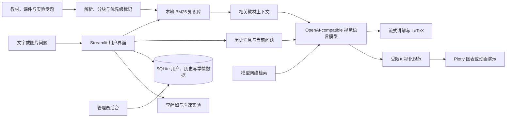

# 大学物理智能助教

面向大学物理课程的本地 RAG 智能助教。项目以祝之光《物理学》第 5 版及配套习题解答为主要依据，并使用课程资料和实验专题知识作为补充，支持教材检索、概念讲解、公式推导、图片识题、历史对话和交互式物理实验。

> 回答以本地知识库为核心，同时由模型服务检索并整合可靠的网络内容作为补充。应用不单独运行网页爬虫，教材课程口径与网络资料不一致时以教材为准。

## 功能

- 本地 RAG：检索教材、习题解答、课件及实验专题知识。
- 网络内容补充：由模型检索知识库未覆盖的背景、最新进展与拓展内容，并与教材结论整合。
- 多模态问答：可直接粘贴或上传题目图片。
- 流式讲解：支持连续对话、LaTeX 公式和回答位置跟随。
- 安全可视化：模型生成结构化绘图规范，由本地校验后使用 Plotly 渲染。
- 双学习模式：在侧栏切换“智能助教”和“可视化实验”。
- 交互实验：内置李萨如图形和声速测量两套 Julia/WGLMakie 实验。
- 用户系统：支持注册登录、匿名进入、历史恢复及 Markdown 导出。
- 管理后台：支持身份名册、学习活动、反馈和运行错误统计。
- 主题与快捷操作：支持亮色、暗色、跟随系统以及随机快速提问。
- 无模型降级：模型不可用时仍可返回本地检索结果。

## 知识库

当前构建清单来自 `agnet/knowledge_base/manifest.json`：

| 内容 | 数量 |
| --- | ---: |
| 扫描文件 | 668 |
| 教学素材文本块 | 35,973 |
| 李萨如专题文本块 | 10,122 |
| 声速专题文本块 | 4,047 |
| 合计文本块 | 50,142 |

其中包括 114 个 PDF、145 个 PPT/PPTX/PPTM/POT 和 389 个 DOC/DOCX 文件。检索使用本地 BM25，并对中文文本加入相邻双字切分。教材正文优先，习题解答次之，其他教学资料和实验知识作为补充。

竞赛项目只提供实验专题知识，不会加载其中的智能体、提示词或用户系统。

## 工作流程



一次普通问答会经历以下过程：

1. 从本地知识库检索与问题最相关的教材和课程内容；
2. 将检索内容、保留的历史消息、文字问题及图片共同发送给模型；
3. 模型以教材内容为主线，检索网络内容补充本地知识库未覆盖的信息；
4. 在页面中流式显示整合后的答案，并持续渲染 Markdown 与 LaTeX；
5. 若答案包含受支持的可视化规范，则在代码之后直接生成运行演示；
6. 注册用户的问答写入历史，反馈与错误写入学情数据库。

## 项目结构

```text
仁爱大学物理智能助教/
├─ README.md                 # 本说明
├─ check_portable_paths.py   # 迁移路径检查
├─ 教学素材/                # Windows 主项目的原始教学资源
├─ agnet/                    # Windows 主项目（保留原目录名）
│  ├─ app.py                # Streamlit 主界面
│  ├─ llm.py                # 模型调用与流式输出
│  ├─ rag.py                # 本地 BM25 检索
│  ├─ build_kb.py           # 知识库构建
│  ├─ visualization.py      # 可视化规范校验和绘图
│  ├─ experiment_hub.py     # 实验启动与嵌入
│  ├─ gateway.py            # 8501 同源入口及内嵌实验代理
│  ├─ experiments/          # 两套 Julia/WGLMakie 实验
│  ├─ storage.py            # 用户、会话和 Markdown 导出
│  ├─ analytics_db.py       # 学情与反馈数据
│  ├─ admin_api.py          # 管理员后台
│  ├─ data/                 # SQLite 数据库及运行数据
│  └─ knowledge_base/       # RAG 文本块、专题索引和清单
└─ rocky/                    # 可独立复制的 Rocky Linux 10 完整版本
   ├─ install.sh            # 普通用户一键安装
   ├─ manage.sh             # 用户级服务管理
   ├─ agnet/                # Rocky 应用、数据和知识库副本
   └─ 教学素材/             # Rocky 原始教学资源副本
```

Windows 版和 Rocky 版是两套独立部署。修改其中一套的运行数据不会自动同步到另一套。

## Windows 版

### 环境要求

- Windows 10/11；
- Python 3.13，由启动脚本通过 `uv` 创建环境；
- [uv](https://docs.astral.sh/uv/)；
- Julia 1.10，仅可视化实验需要；
- 支持 WebGL2 的现代浏览器；
- OpenAI Chat Completions 兼容的文本或视觉模型服务。

Poppler 用于提取 PDF 文本；WPS Office 可帮助解析旧式 `.doc`、`.ppt` 和 `.pot` 文件。现成知识库无需重新安装这些解析工具。

### 启动

```powershell
cd .\agnet
.\start_all.ps1
```

浏览器访问：

```text
http://localhost:8501
```

`start_all.ps1` 同时启动主应用和管理员服务。只启动主应用时可运行 `start.ps1` 或双击 `start.bat`。

Windows 版端口：

| 服务 | 监听地址 |
| --- | --- |
| 对外统一入口 | `0.0.0.0:8501` |
| Streamlit 内部服务 | 仅监听本机 |
| 管理员内部服务 | 仅监听本机 |
| 李萨如与声速实验 | 仅监听本机，通过 `8501/experiments/...` 内嵌 |

### 模型及管理员配置

```powershell
Copy-Item .\.streamlit\secrets.toml.example .\.streamlit\secrets.toml
```

编辑 `agnet/.streamlit/secrets.toml`：

```toml
physics_api_key = ""
physics_base_url = "http://模型服务地址/v1"
physics_model = "模型 ID"

admin_username = "admin"
admin_display_name = "课程管理员"
admin_password = "至少 12 位的独立强密码"
admin_token = "足够长的随机令牌"
admin_login_url = "/admin-login"
```

不要把 `secrets.toml`、API Key、密码或内网令牌提交到 Git。

也可以使用环境变量覆盖配置：

| 环境变量 | 用途 |
| --- | --- |
| `PHYSICS_BASE_URL` | OpenAI-compatible API 根地址，通常以 `/v1` 结尾 |
| `PHYSICS_MODEL` | 模型 ID |
| `PHYSICS_API_KEY` | 模型服务密钥；无鉴权的本地服务可留空 |
| `DASHSCOPE_API_KEY` | 兼容的 Qwen/DashScope 回退密钥 |
| `PHYSICS_CONTEXT_WINDOW` | 模型上下文窗口预算 |
| `PHYSICS_HISTORY_MAX_MESSAGES` | 单次请求最多携带的历史消息数 |
| `PHYSICS_MAX_OUTPUT_TOKENS` | 单次回答最大输出 token 数 |
| `PHYSICS_JULIA_EXE` | Julia 可执行文件路径 |
| `PHYSICS_CJK_FONT` | Rocky 上可选的中文字体文件 |

联网检索属于固定回答策略，不设置用户开关。模型名称只保存在配置和运行日志中，普通用户页面不会展示底层模型 ID。

### Windows 局域网访问

以管理员身份打开 PowerShell，在项目根目录运行：

```powershell
.\agnet\enable_lan.ps1
```

脚本只为专用网络开放统一入口 `8501`。管理员页面和两套可视化实验均从主站内嵌访问，不再单独开放端口。其他设备访问 `http://Windows主机IP:8501`。

## Rocky Linux 10 独立版

Rocky 版已包含应用、知识库、原始教学素材、两套实验以及迁移时的用户和历史数据。它只安装在复制后的普通用户目录中：

- 不允许使用 `sudo` 或 root 执行；
- 不写入 `/opt`、`/etc`、`/var` 或 `/usr/local`；
- 不修改 systemd、Nginx、SELinux 或 firewalld；
- Python、Julia、配置、日志和 PID 均保存在 `rocky` 目录内。

### 复制与安装

在 Windows 项目根目录复制：

```powershell
scp -r ".\rocky" 用户名@Rocky服务器IP:~/
```

登录服务器后，以普通用户执行：

```bash
cd ~/rocky
bash install.sh
```

安装完成后访问 `http://Rocky服务器IP:8501`。详细要求和故障处理见 [Rocky 部署说明](rocky/README.md)。

### 服务管理

```bash
cd ~/rocky
bash manage.sh start
bash manage.sh stop
bash manage.sh restart
bash manage.sh status
bash manage.sh check
bash manage.sh logs
```

Rocky 版不会注册系统级开机服务，服务器重启后需再次执行 `bash manage.sh start`。

Rocky 版使用目录内的 Python 网关统一公开 `8501`：

| 服务 | 监听地址 |
| --- | --- |
| 对外统一入口 | `0.0.0.0:8501` |
| Streamlit 内部服务 | `127.0.0.1:8502` |
| 管理员内部服务 | `127.0.0.1:8603` |
| 李萨如与声速实验 | 仅监听 `127.0.0.1`，由统一入口代理 |

安装脚本不会修改防火墙。若局域网客户端无法访问，应由服务器管理员按实际网段仅放行 TCP `8501`；Streamlit、管理员和实验内部服务均不应对外开放。

Rocky 模型配置位于：

```text
~/rocky/config/physics-assistant.env
```

修改后执行 `bash manage.sh restart`。

Rocky 安装脚本会在用户目录中准备 Python 3.13、项目虚拟环境、Julia 1.10.10 和 Julia depot。安装阶段需要访问 Python 包源与 Julia 官方下载站；回答阶段由模型服务检索网络内容，应用自身不启动独立网页爬虫。

## 登录、历史与管理员后台

首次打开主页会先显示登录入口：

- **注册用户**：登录后持续保存对话历史，可恢复会话并导出 Markdown；
- **匿名用户**：无需注册即可进入，消息只在当前浏览器会话中保留，也可手动导出 Markdown；
- **管理员用户**：在同一登录页面验证账号后跳转管理员页面。

注册账号、消息、反馈、身份名册和学情记录统一保存在：

```text
agnet/data/assistant.db
```

管理员后台包含：

- 注册用户、匿名请求和活跃情况总览；
- 章节和主题分布；
- 回答评价及用户意见；
- 模型、网络、图片识别和可视化运行错误；
- Excel 身份名册导入及账号关联。

Windows 版管理员 API 默认仅监听 `127.0.0.1:8603`。Rocky 版由 `8501` 用户级网关转发管理员路由，因此学生页面和管理员页面共用一个对外端口，`8603` 不对局域网开放。

历史消息会受到上下文预算限制：数据库可长期保留完整记录，但每次调用模型时只选取不超过 `PHYSICS_HISTORY_MAX_MESSAGES` 且能放入模型上下文窗口的近期内容。这能避免长对话超过模型限制，同时保持连续问答的上下文联系。

## 重新构建知识库

Windows：

```powershell
cd .\agnet
.\.venv\Scripts\python.exe .\build_kb.py
```

Rocky：

```bash
cd ~/rocky
./agnet/.venv/bin/python ./agnet/build_kb.py
```

构建结果位于 `agnet/knowledge_base/`：

- `chunks.jsonl`：可检索文本块；
- `manifest.json`：文件数、文本块数、失败记录和资料策略；
- `imports/lissajous.jsonl`：李萨如实验专题知识；
- `imports/sound_speed.jsonl`：声速测量专题知识。

若只更新了专题索引，Windows 可运行：

```powershell
.\.venv\Scripts\python.exe .\build_kb.py --merge-imports-only
```

扫描版 PDF 没有文字层时应先 OCR。Rocky 重新解析旧 Office 文件时建议由服务器管理员提供 LibreOffice headless；现成知识库的使用不受影响。

## 可视化实验

首页侧栏切换到“可视化实验”后可选择：

- 李萨如图形：相位差、振幅比、有理频率比和频率失谐；
- 声速测量：回声法、双麦克风时差法、示波器相位差法和驻波法。

实验按需启动，主要图形在客户端浏览器通过 WebGL2 渲染，纯 CPU Rocky 服务器也可运行。Windows 首次使用前可手动初始化：

```powershell
cd .\agnet
julia --project=experiments/lissajous -e "using Pkg; Pkg.instantiate(); Pkg.precompile()"
julia --project=experiments/sound_speed -e "using Pkg; Pkg.instantiate(); Pkg.precompile()"
```

Rocky 的 `install.sh` 默认完成相同的初始化；可用 `PRECOMPILE_EXPERIMENTS=0 bash install.sh` 暂时跳过。

## 对话内可视化

“智能助教”模式也可直接提出绘图或动画请求，例如：

- “绘制简谐振动的位移—时间曲线，并标出振幅和周期。”
- “比较三种阻尼系数下振幅随时间的变化。”
- “生成平抛运动轨迹，演示初速度变化的影响。”
- “把这组实验数据绘制成散点图并拟合趋势。”

回答中的可视化代码会先显示，再在其后生成运行演示窗口。项目对数学表达式、变量、函数、指数范围及数据规模进行白名单校验，不允许模型直接执行任意 Python、Shell、文件读写或网络请求。支持的输出由实际绘图规范决定，可包括交互图、静态图以及 GIF/MP4 动画。

图片题可直接粘贴到聊天输入框，也可通过上传入口选择文件。视觉模型会同时接收图片、文字追问、近期对话和本地检索内容，因此可以继续追问图片中的某一步推导。

## 数据、迁移与安全

- 注册账号、历史、反馈和学情数据位于 `agnet/data/assistant.db`。
- 匿名用户无需注册；匿名历史只在当前会话保留，但仍可导出 Markdown。
- 模型服务不可用不会损坏知识库或用户数据库。
- 可视化模块只接受经过限制的数学表达式，不执行任意 Shell、文件或网络代码。
- 发布仓库前请移除受版权保护的教材、内部数据库和私密配置。
- 模型回答可能存在错误，关键公式、适用条件和数值结果应由教师或学习者复核。

主要数据位置：

| 数据 | Windows 主项目 | Rocky 独立版 |
| --- | --- | --- |
| 用户与历史 | `agnet/data/assistant.db` | `rocky/agnet/data/assistant.db` |
| RAG 文本块 | `agnet/knowledge_base/chunks.jsonl` | `rocky/agnet/knowledge_base/chunks.jsonl` |
| 构建清单 | `agnet/knowledge_base/manifest.json` | `rocky/agnet/knowledge_base/manifest.json` |
| 私密模型配置 | `agnet/.streamlit/secrets.toml` | `rocky/config/physics-assistant.env` |
| Rocky 日志 | 不适用 | `rocky/.runtime/logs/` |

Rocky 文件夹是某次迁移时生成的完整快照。Windows 版后续新增的账号、历史、教材或知识库不会自动进入 Rocky 版；需要重新执行安全迁移或有选择地同步相应数据文件。迁移数据库时应先停止写入，或使用 SQLite 在线备份，避免复制到不一致的 WAL 状态。

迁移前可检查源码、知识库和 SQLite 数据中是否写死 Windows 盘符：

```powershell
.\agnet\.venv\Scripts\python.exe .\check_portable_paths.py
```

## 常见问题

### 8501 端口被占用

```powershell
Get-NetTCPConnection -LocalPort 8501 -State Listen
Stop-Process -Id <OwningProcess>
```

停止前请确认该 PID 属于本项目。

### 图片能上传但模型不能识别

确认配置的是支持视觉输入的模型，并检查模型服务是否接受 OpenAI-compatible 的图片消息格式。

### 连续追问似乎没有利用前文

检查 `PHYSICS_HISTORY_MAX_MESSAGES` 和 `PHYSICS_CONTEXT_WINDOW`。历史会完整保存在数据库，但发送给模型的内容必须为检索资料、图片和回答预留空间；模型服务本身设置的上下文上限也不能低于项目配置。

### 公式显示为反斜杠文本

建议使用 `$...$` 表示行内公式、`$$...$$` 表示独立公式。项目会在流式输出过程中修正常见定界符，但模型输出未闭合、嵌套代码块或不完整 LaTeX 时仍可能无法渲染。

### 可视化代码显示了但没有运行结果

先查看页面中的运行错误提示，再检查 `agnet/requirements.txt` 中的 Plotly、NumPy、imageio 和 FFmpeg 相关依赖。GIF/MP4 动画还会受到代码格式、执行校验、编码器和服务器 CPU 性能影响。

### 实验页面无法打开

确认 Julia 依赖已完成初始化、主站 `8501` 可以访问且客户端浏览器支持 WebGL2。实验通过主站同源内嵌，不需要另开端口。Rocky 可运行 `bash manage.sh logs` 查看主服务日志；Julia 实验日志位于应用运行目录的 `runtime/experiments/`。

### Rocky 重启后网页无法访问

```bash
cd ~/rocky
bash manage.sh start
```

### Rocky 安装失败并提示缺少系统命令

用户目录安装器不会调用 `dnf`。请让服务器管理员预先提供 `curl`、`tar`、`gzip`、`sha256sum` 和 `awk`。

## 技术栈

- Streamlit / FastAPI / SQLite
- OpenAI-compatible Chat Completions
- 本地 BM25
- Plotly
- Julia / Bonito / WGLMakie
- Poppler / WPS COM / LibreOffice headless

## 版权说明

请仅使用自己拥有或已获授权的教材、课件和教学资料。公开 GitHub 仓库时建议只提交程序代码和可公开数据，不要上传受版权保护的教材全文或真实用户数据。
